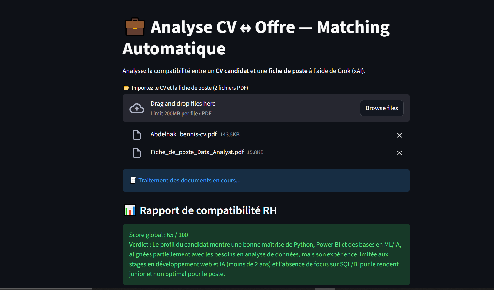

# 🧠 Système Intelligent d’Analyse et de Matching CV ↔ Offre RH (Grok xAI)

Ce projet met en œuvre un **système multi-agents IA** conçu pour **analyser**, **comparer** et **évaluer la compatibilité** entre un **CV candidat** et une **fiche de poste**.  
Il repose sur le framework **Agno**, le modèle **xAI Grok-4**, et une interface **Streamlit** simple et interactive.  

---

## 🚀 Objectif du projet

Créer un **assistant RH intelligent** capable de :
- Analyser automatiquement le contenu d’un CV et d’une fiche de poste en PDF.  
- Extraire les compétences techniques, les expériences et les formations pertinentes.  
- Comparer les deux documents selon une **logique sémantique avancée**.  
- Calculer un **score global de correspondance (%)**.  
- Générer un **rapport RH clair**, avec verdict et recommandations.

Ce système agit comme un **outil d’aide à la décision** pour les recruteurs, en simulant le raisonnement d’un expert RH.

---

## 🧩 Architecture Technique

### 🏗️ Structure Globale

cv-analyse/
│
├── app.py # Interface Streamlit principale
│
├── agents/
│ ├── extract_agent.py # Extraction du texte brut depuis les PDF
│ ├── nlp_agent.py # Analyse des CV et offres via NLP
│ ├── match_agent.py # Matching et score de compatibilité
│ └── recruiter_agent.py # Génération du rapport RH final
│
├── .env # Contient la clé API xAI (Grok)
├── requirements.txt # Dépendances Python
├── image.png # Capture d’écran de l’application
└── README.md # Documentation du projet

---

## ⚙️ Technologies Utilisées

| Composant | Rôle |
|------------|------|
| 🐍 *Python 3.11+* | Langage principal |
| 🎨 *Streamlit* | Interface utilisateur web |
| 🧠 *xAI (Grok-4)* | Modèle LLM d’analyse sémantique |
| 🤖 *Agno* | Framework multi-agents pour coordination IA |
| 📄 *PyMuPDF (fitz)* | Extraction de texte PDF |
| ⚙️ *dotenv* | Chargement sécurisé de la clé API |
| 📊 *JSON* | Structure de sortie et rapport RH |

---

## 🧠 Agents et Rôles

| Agent | Description | Entrées / Sorties |
|--------|--------------|------------------|
| 📑 *ExtractAgent* | Extrait le texte brut et le nettoie (CV + offre) | Entrée : fichiers PDF → Sortie : texte structuré |
| 🧩 *NLPAagent* | Analyse sémantique des documents (compétences, expériences) | Entrée : texte brut → Sortie : profil structuré |
| 🔍 *MatchAgent* | Compare CV et offre, calcule un score (%) | Entrée : deux profils analysés → Sortie : rapport RH |
| 💬 *RecruiterAgent* | Génère une réponse finale lisible et concise | Entrée : rapport brut → Sortie : texte résumé pour RH |

---

## 💬 Interface Streamlit

L’interface offre une expérience utilisateur intuitive :

- 📂 Téléversement de deux fichiers PDF (CV + offre)
- ⚙️ Traitement automatique du texte et analyse sémantique
- 📊 Affichage du **score de correspondance RH**
- 🧾 Rapport clair :  
  1️⃣ Points forts du candidat  
  2️⃣ Écarts identifiés  
  3️⃣ Recommandation finale

---

## 🧩 Workflow du Système

**Utilisateur → ExtractAgent → NLPAgent → MatchAgent → RecruiterAgent → Rapport RH final**

### Étapes clés :
1. **Extraction du texte** depuis les fichiers PDF (fitz).  
2. **Analyse sémantique** via le modèle Grok (xAI).  
3. **Comparaison automatique** des compétences et expériences.  
4. **Calcul du score global** de correspondance.  
5. **Génération du rapport RH final**.

---

## 📊 Exemple de Résultat

> ### 📋 Rapport de compatibilité RH  
> **Score global : 87 / 100**  
>  
> **Compétences alignées :** Python, Power BI, Machine Learning  
> **À renforcer :** SQL avancé, Cloud (Azure, GCP)  
>  
> **Verdict :** Le candidat correspond très bien au poste, avec un potentiel d’évolution rapide dans le domaine de la data.

---

## 🖼️ Aperçu de l’application



---

## 💼 Cas d’utilisation

- **Recruteurs :** évaluation rapide et objective des profils.  
- **Entreprises :** tri intelligent des CV à grande échelle.  
- **Candidats :** auto-évaluation avant de postuler.  
- **Écoles / universités :** accompagnement à l’insertion professionnelle.

---

## 🧪 Scénario de Test

### 🧮 *Cas d’usage — Candidat Data Analyst*

*CV :* Profil ingénieur MIAGE avec expérience IA, Power BI, et Python.  
*Fiche de poste :* Data Analyst avec maîtrise SQL, Cloud et Python.

**Résultat attendu :**
1️⃣ Score de compatibilité : 78 / 100  
2️⃣ Compétences alignées : Python, Power BI, ML  
3️⃣ Lacunes : SQL avancé, Cloud  
4️⃣ Verdict : Profil prometteur, à renforcer sur la partie data engineering.

---

## 🧰 Installation & Exécution

### 1. Cloner le dépôt
```bash
git clone https://github.com/a-bennis/cv-analyse.git
cd cv-analyse
## ⚙ Technologies Utilisées

| Composant | Rôle |
|------------|------|
| *Python 3.11+* | Langage principal |
| *Agno* | Framework multi-agents |
| *xAI (Grok-2)* | Modèle LLM de raisonnement |
| *Streamlit* | Interface utilisateur (chatbot) |
| *dotenv* | Chargement sécurisé de la clé API |
